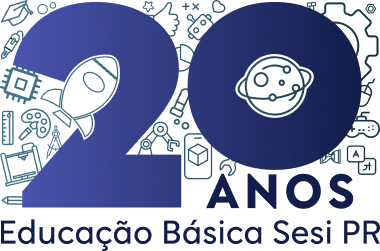

# SESI - 20 Anos de Educação Básica



## Visão Geral

Este projeto é uma página institucional comemorativa dos 20 anos da Educação Básica do SESI Paraná, que apresenta a metodologia inovadora STEAM, os diferenciais do ensino, missão e visão, e um formulário para contato.

A página é responsiva e construída com foco em acessibilidade, usabilidade e design moderno.

---

## Tecnologias Utilizadas

- HTML5  
- CSS3  
- Google Fonts (Lato)  
- Font Awesome  
- JavaScript (validação básica do formulário)

---

## Funcionalidades

- Header com links institucionais  
- Seção hero com slogan e selo comemorativo  
- Vídeo comemorativo incorporado  
- Listagem dos diferenciais do SESI  
- Explicação da metodologia STEAM  
- Formulário de contato com validação simples  
- Cards das instituições SESI  
- Rodapé com selo comemorativo

---

## Como executar

1. Clone este repositório:

```bash
git clone https://github.com/gabriel-araujo-git/Sesi_20_anos.git
```

2. Entre na pasta do projeto:

```bash
cd Sesi_20_anos
```

3. Abra o arquivo `index.html` no seu navegador preferido.

---

## Contato

**Gabriel Araujo**  
Email: ga2951057@gmail.com  
GitHub: [gabriel-araujo-git](https://github.com/gabriel-araujo-git)

---

## Considerações Finais

Este projeto consiste na implementação de um site comemorativo pelos 20 anos da Educação Básica do SESI, desenvolvido conforme as premissas e orientações fornecidas no arquivo base do projeto. O site foi construído com foco na usabilidade, responsividade e alinhamento à identidade visual do SESI, garantindo uma experiência agradável para os usuários.

Para complementar o desenvolvimento, foi preparada uma apresentação em formato PPT que demonstra a estruturação técnica do site, as metodologias de gestão adotadas durante o desenvolvimento e as tecnologias utilizadas, como HTML5, CSS3 e JavaScript. Além disso, a apresentação inclui trechos de código selecionados que ilustram aspectos importantes do desenvolvimento, como a criação de componentes reutilizáveis e o gerenciamento do layout responsivo.

O projeto reflete a importância de um planejamento detalhado e da aplicação de boas práticas em desenvolvimento web para atender às expectativas institucionais, proporcionando uma plataforma eficiente para celebrar este marco significativo na educação básica do SESI.